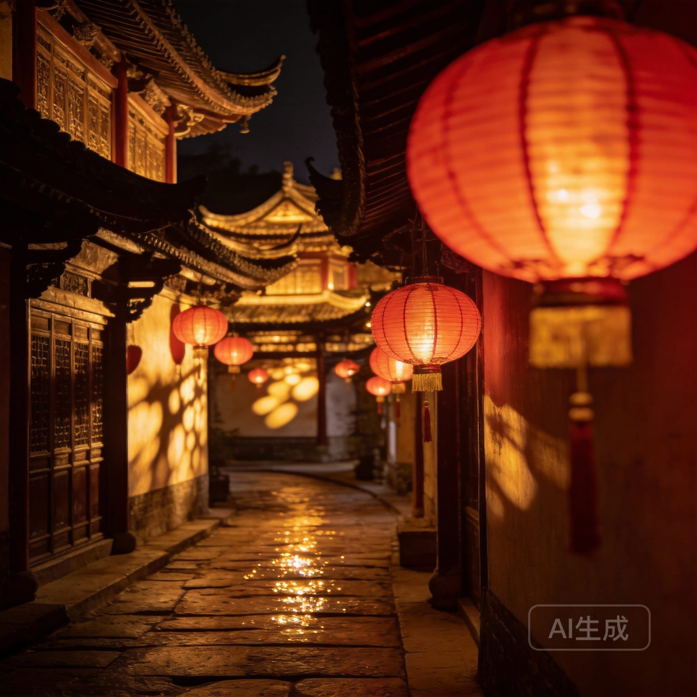
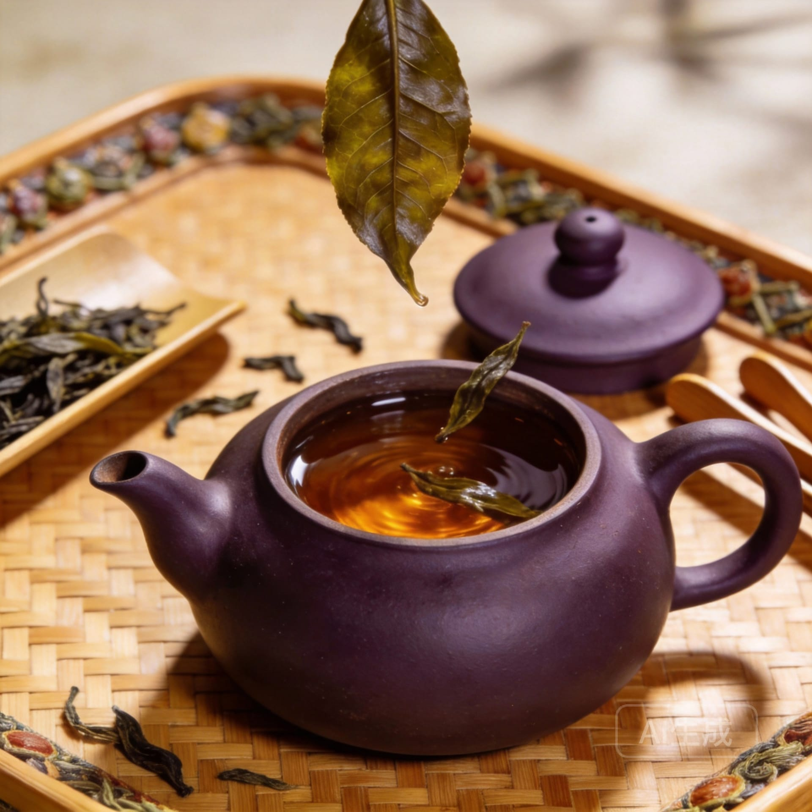
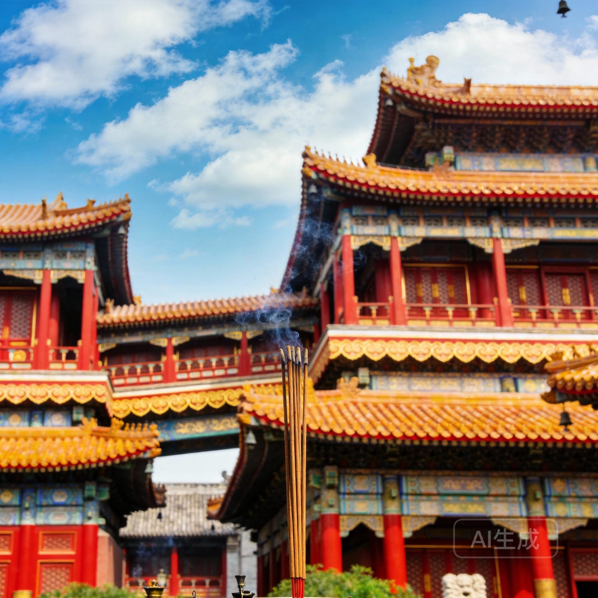
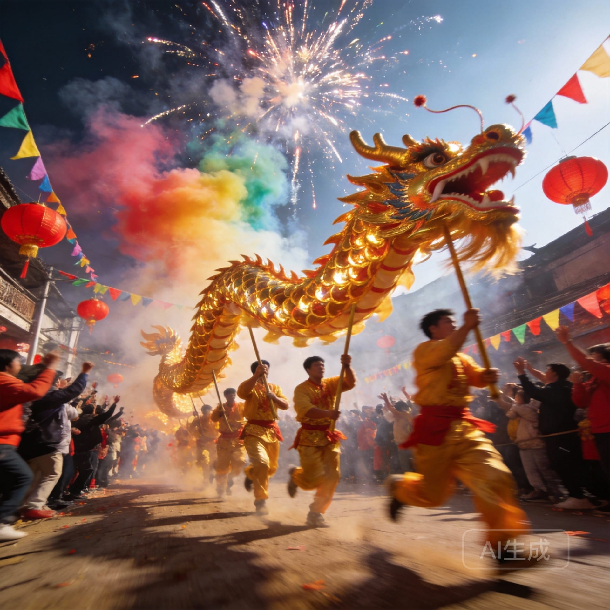
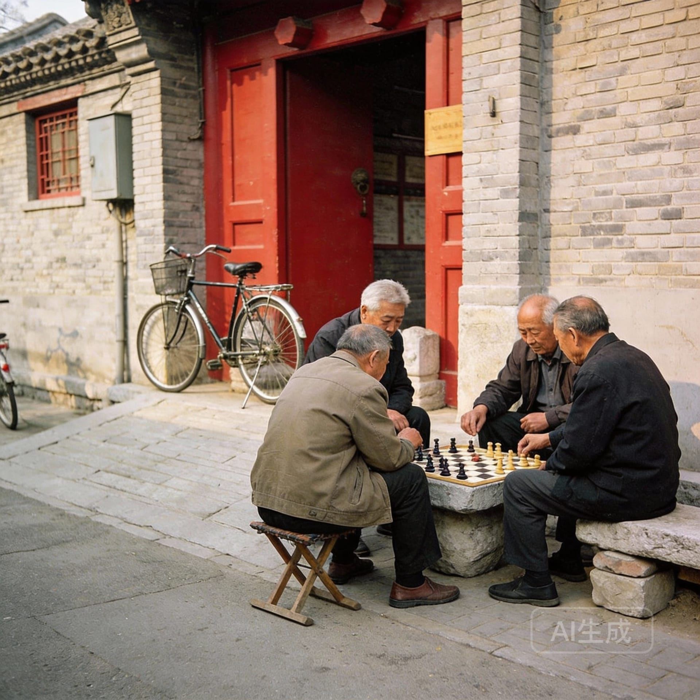
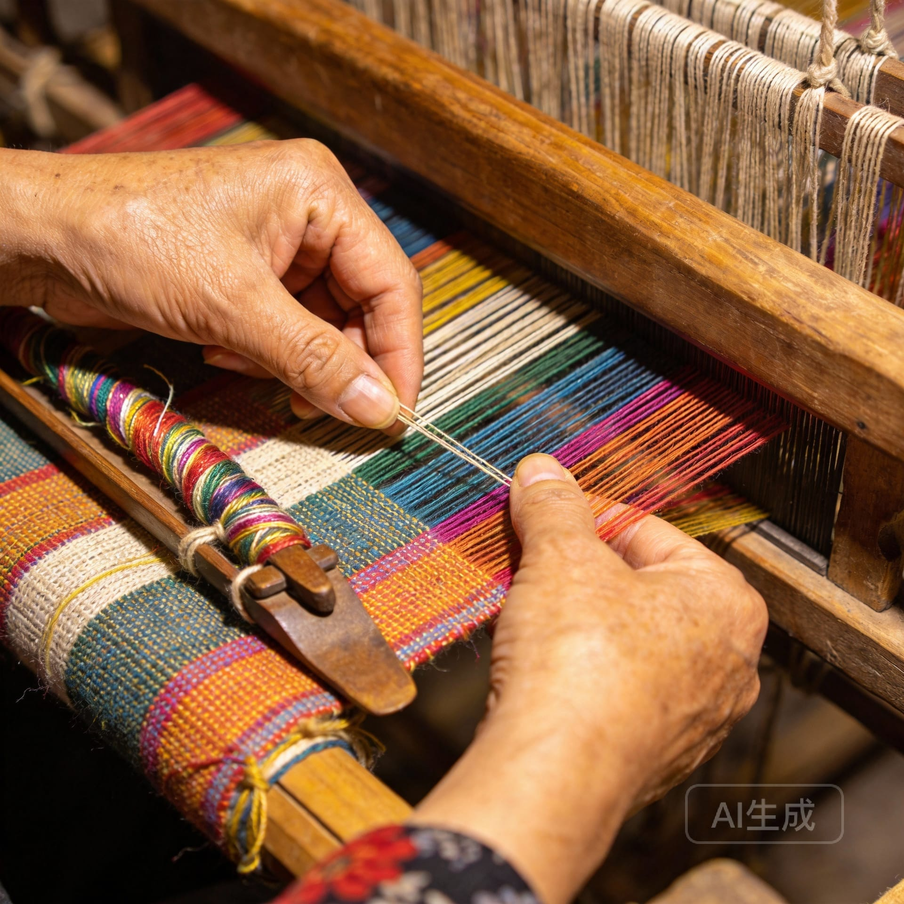
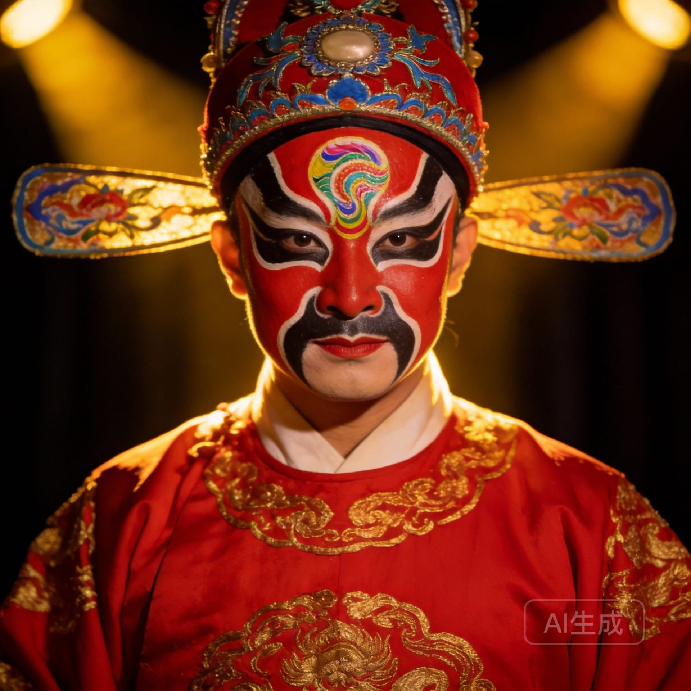

# 测试图片集合

生成时间: 2026/1/22 17:09:20

## 图片列表

### 1. 传统灯笼节庆场景

- **ID**: lantern-festival
- **文件**: lantern-festival.jpg
- **标签**: 灯笼, 古街, 节庆, 夜景
- **提示词**: 中国传统红灯笼挂满古街，夜晚温暖灯光，石板路，明清建筑风格，电影感构图，高清摄影

### 2. 茶文化与茶艺

- **ID**: tea-ceremony
- **文件**: tea-ceremony.jpg
- **标签**: 茶艺, 茶道, 传统工艺, 禅意
- **提示词**: 中国传统茶艺表演，紫砂茶壶，竹制茶盘，茶叶特写，温暖自然光，禅意美学，高清摄影

### 3. 寺庙建筑与宗教文化

- **ID**: temple-architecture
- **文件**: temple-architecture.jpg
- **标签**: 寺庙, 建筑, 宗教, 古建筑
- **提示词**: 中国古代寺庙建筑，红墙金瓦，飞檐斗拱，香炉青烟，蓝天白云，对称构图，建筑摄影

### 4. 书法艺术与文房四宝

- **ID**: calligraphy-art
- **文件**: calligraphy-art.jpg
- **标签**: 书法, 毛笔, 文化, 艺术
- **提示词**: 中国书法艺术，毛笔字特写，宣纸墨迹，文房四宝，侧光拍摄，文化氛围，艺术摄影

### 5. 舞龙表演与民俗庆典

- **ID**: dragon-dance
- **文件**: dragon-dance.jpg
- **标签**: 舞龙, 民俗, 庆典, 表演
- **提示词**: 中国舞龙表演，金色巨龙，节庆人群，动态瞬间，烟花背景，广角镜头，节日氛围

### 6. 胡同生活与传统民居

- **ID**: hutong-alley
- **文件**: hutong-alley.jpg
- **标签**: 胡同, 四合院, 生活方式, 民居
- **提示词**: 北京胡同街景，灰砖四合院，红色大门，自行车，老人下棋，生活气息，纪实摄影

### 7. 丝绸织造传统工艺

- **ID**: silk-weaving
- **文件**: silk-weaving.jpg
- **标签**: 丝绸, 织造, 工艺, 手工
- **提示词**: 中国丝绸织造工艺，传统织布机，彩色丝线，工匠手工操作，细节特写，工艺美学

### 8. 京剧脸谱与戏曲艺术

- **ID**: opera-mask
- **文件**: opera-mask.jpg
- **标签**: 京剧, 脸谱, 戏曲, 传统艺术
- **提示词**: 中国京剧脸谱特写，红色花脸，精致彩绘，戏曲服饰，舞台灯光，传统艺术，人像摄影

### 9. 梯田农耕文化景观

- **ID**: rice-terrace
- **文件**: rice-terrace.jpg
- **标签**: 梯田, 农耕, 自然, 景观
- **提示词**: 中国南方梯田景观，层层叠叠，绿色稻田，水面倒影，晨雾缭绕，航拍视角，自然风光

### 10. 剪纸艺术与节庆装饰

- **ID**: paper-cutting
- **文件**: paper-cutting.jpg
- **标签**: 剪纸, 窗花, 民间艺术, 春节
- **提示词**: 中国剪纸艺术，红色窗花，精细镂空图案，春节装饰，逆光拍摄，民间艺术，特写摄影

